# C++ Runtime Overview

## Overview

The TensorRT Edge-LLM C++ Runtime provides a comprehensive inference system for Large Language Models (LLMs) and Vision Language Models (VLMs) built on top of TensorRT. The runtime implements a layered architecture that manages the autoregressive decoding loop required for language model inference, handling everything from tokenization to final text generation.

### Purpose

The C++ Runtime serves as the **final stage** in the TensorRT Edge-LLM workflow:

```mermaid
%%{init: {'theme':'neutral', 'themeVariables': {'primaryColor':'#76B900','primaryTextColor':'#fff','primaryBorderColor':'#5a8f00','lineColor':'#666','edgeLabelBackground':'#ffffff','labelTextColor':'#000','clusterBkg':'#ffffff','clusterBorder':'#999'}}}%%
graph LR
    HF_MODEL[HuggingFace<br>Model]
    PYTHON_EXPORT[tensorrt_edgellm<br>ONNX<br>Export]
    ONNX_FILES[ONNX<br>Models]
    ENGINE_BUILDER[Engine<br>Builder]
    TRT_ENGINE[TensorRT<br>Engine]
    OUTPUT[Inference<br>Results]

    subgraph RUNTIME_SG [" "]
        CPP_RUNTIME[C++<br>Runtime]
    end

    HF_MODEL --> PYTHON_EXPORT
    PYTHON_EXPORT --> ONNX_FILES
    ONNX_FILES --> ENGINE_BUILDER
    ENGINE_BUILDER --> TRT_ENGINE
    TRT_ENGINE --> CPP_RUNTIME
    CPP_RUNTIME --> OUTPUT

    classDef inputNode fill:#f5f5f5,stroke:#999,stroke-width:1px,color:#333
    classDef nvLightNode fill:#b8d67e,stroke:#76B900,stroke-width:1px,color:#333
    classDef nvNode fill:#76B900,stroke:#5a8f00,stroke-width:1px,color:#fff
    classDef itemNode fill:#ffffff,stroke:#999,stroke-width:1px,color:#333
    classDef darkNode fill:#ffffff,stroke:#999,stroke-width:1px,color:#333
    classDef greenSubGraph fill:none,stroke:#76B900,stroke-width:1.5px

    class HF_MODEL inputNode
    class PYTHON_EXPORT,ENGINE_BUILDER nvLightNode
    class CPP_RUNTIME nvNode
    class ONNX_FILES,TRT_ENGINE itemNode
    class OUTPUT darkNode
    class RUNTIME_SG greenSubGraph
```

---

## Runtime Architecture

The C++ runtime is organized around **two distinct, mutually exclusive runtime implementations** that serve different inference scenarios. Both runtimes share the same high-level API (`handleRequest`) but implement fundamentally different execution strategies:

| Component | Description |
|-----------|-------------|
| **LLM Inference Runtime** | Unified runtime for all LLM inference, supporting both vanilla autoregressive decoding and speculative decoding modes (EAGLE, MTP, etc.) through a pluggable `DecodingStrategy` layer. When constructed without a drafting config, operates as a pure vanilla decoding runtime. When constructed with a `SpecDecodeDraftingConfig`, additionally loads a draft model and enables speculative decoding strategies. Manages memory allocation, request processing, tokenization, multimodal preprocessing (vision + audio), and response generation. |
