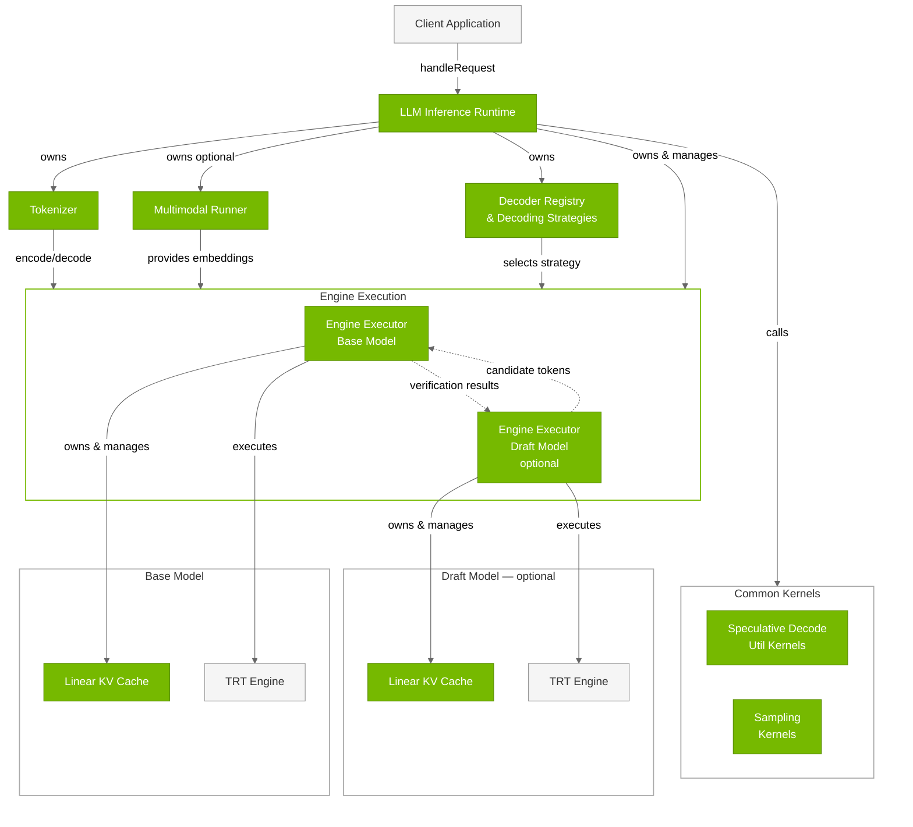

# LLM Inference Runtime

## Architecture

The **LLM Inference Runtime** (`LLMInferenceRuntime`) is the unified runtime for all LLM inference in TensorRT Edge-LLM. It supports both standard autoregressive (vanilla) decoding and speculative decoding modes (EAGLE, MTP, DFlash, etc.) through a pluggable `DecodingStrategy` layer. When constructed without a drafting config, it operates as a pure vanilla decoding runtime with zero draft-model memory overhead. When constructed with a `SpecDecodeDraftingConfig`, it additionally loads a draft model and enables speculative decoding strategies.




---


### Key Components


| Component | Description |
|-----------|-------------|
| **Engine Executor (Base)** | Executes TensorRT engines and manages dual-phase inference for the base model. Core engine execution component owned by `LLMInferenceRuntime`. Uses a single TensorRT execution context that switches optimization profiles between prefill and generation phases. Manages its own Linear KV Cache instance, produces logits that are consumed by the runtime's sampling calls. Supports dynamic LoRA adapter switching. *Files:* `cpp/runtime/exec/engineExecutor.{h,cpp}` |
| **Engine Executor (Draft — optional)** | Specialized engine executor for draft models used in speculative decoding (for example, EAGLE3, MTP, or DFlash). Only instantiated when a `SpecDecodeDraftingConfig` is provided. Generates candidate token sequences that are verified by the base model. Maintains its own separate KV cache. *Files:* `cpp/runtime/exec/engineExecutor.{h,cpp}` |
| **Decoder Registry & Decoding Strategies** | Pluggable decoding strategy layer introduced by the runtime refactor. The `DecoderRegistry` selects the appropriate `DecodingStrategy` (Vanilla, EAGLE, MTP, DFlash, etc.) based on the deployment config and per-request compatibility. Each strategy owns its decode-step logic, private resources, CUDA graph capture, and strategy-specific prompt cache. *Files:* `cpp/runtime/decoding/decoderRegistry.{h,cpp}`, `cpp/runtime/decoding/decodingStrategy.h` |
| **Tokenizer** | HuggingFace-compatible text tokenization system. Converts between text and token IDs using Byte-Pair Encoding (BPE). Supports various model vocabularies (GPT, Llama, Qwen) with configurable special tokens and preprocessing steps. *Files:* `cpp/tokenizer/tokenizer.{h,cpp}`, `preTokenizer.{h,cpp}`, `tokenEncoder.{h,cpp}` |
| **Multimodal Runner** | Vision and audio processing for multimodal models (VLMs). Processes image/audio inputs through Vision/Audio Transformer models and generates embeddings. Supports Qwen-VL, InternVL, and Qwen-Audio architectures. Integrates multimodal embeddings with text tokens for multimodal inference. *Files:* `cpp/multimodal/multimodalRunner.{h,cpp}`, `qwenViTRunner.{h,cpp}`, `internViTRunner.{h,cpp}` |
| **Linear KV Cache** | Attention key-value cache management. Each engine executor maintains its own Linear KV Cache instance. Stores attention key-value pairs across inference steps for efficient autoregressive generation. Uses linear memory layout optimized for GPU access with support for batched processing and variable sequence lengths. *Files:* `cpp/runtime/linearKVCache.{h,cpp}` |
| **Sampling Kernels** | Token generation from model logits. Converts model output logits into probability distributions and samples the next token using configurable strategies (greedy, top-k, top-p, temperature). Called directly by the runtime (not by engine executors) after engine execution produces logits. Operates on GPU for efficient batch processing. *Files:* `cpp/sampler/sampling.{cu,h}` |
| **Speculative Decode Util Kernels** | Speculative decoding utility kernels (only used when a draft model is present). Specialized CUDA kernels for tree-based and block-based speculative decoding operations. Handles candidate token generation, verification logic, and accept/reject mechanisms for speculative tokens. *Files:* `cpp/kernels/speculative/` |
| **TRT Engines** | TensorRT inference engines. In vanilla mode, a single base engine is used. In speculative decoding mode, dual engines (base + draft) are used. Optimized TensorRT engines compiled from ONNX models. Provides high-performance inference through TensorRT optimizations including kernel fusion, precision calibration, and memory optimization. *Files:* Built by `llm_build` (see Engine Builder section) |


## Inference Workflow

### Vanilla Decoding (No Draft Model)

When constructed without a `SpecDecodeDraftingConfig`, the runtime performs standard autoregressive generation:

```mermaid
%%{init: {'theme':'neutral', 'themeVariables': {'primaryColor':'#76B900','primaryTextColor':'#fff','primaryBorderColor':'#5a8f00','lineColor':'#666','edgeLabelBackground':'#ffffff','labelTextColor':'#000','clusterBkg':'#ffffff','clusterBorder':'#999'}}}%%
graph LR
    INPUT_PROMPT(Input<br/>Prompt) --> TOKENIZER(Tokenize)

    subgraph VIT_BOX ["Optional"]
        VIT_PROCESS(ViT<br>Processing)
    end

    TOKENIZER --> VIT_PROCESS
    VIT_PROCESS --> PREFILL_ENGINE(Prefill<br/>**TRT Engine**)

    PREFILL_ENGINE --> GENERATE_KV[Generate<br/>KV-Cache]
    GENERATE_KV --> SAMPLE_FIRST(Sample First<br/>Token)

    SAMPLE_FIRST --> GENERATION_ENGINE[Generation<br/>**TRT Engine** or<br>**CUDA Graph**]

    GENERATION_ENGINE --> UPDATE_KV(Update<br>KV Cache)
    UPDATE_KV --> SAMPLE_TOKEN(Sample Next<br/>Token)

    SAMPLE_TOKEN --> STOP_CHECK{Stop<br/>Condition?}
    STOP_CHECK -->|N| GENERATION_ENGINE
    STOP_CHECK -->|Y| OUTPUT_SEQUENCE(Generated<br/>Sequence)

    subgraph PHASE1 ["Phase 1: Prefill"]
        PREFILL_ENGINE
        GENERATE_KV
        SAMPLE_FIRST
    end

    subgraph PHASE2 ["Phase 2: Generation"]
        GENERATION_ENGINE
        UPDATE_KV
        SAMPLE_TOKEN
        STOP_CHECK
        OUTPUT_SEQUENCE
    end

    classDef greyNode fill:#f5f5f5,stroke:#999,stroke-width:1px,color:#333
    classDef darkNode fill:#ffffff,stroke:#999,stroke-width:1px,color:#333
    classDef nvNode fill:#76B900,stroke:#5a8f00,stroke-width:1px,color:#fff
    classDef nvLightNode fill:#b8d67e,stroke:#76B900,stroke-width:1px,color:#333
    classDef inputNode fill:#f5f5f5,stroke:#999,stroke-width:1px,color:#333
    classDef itemNode fill:#ffffff,stroke:#999,stroke-width:1px,color:#333
    classDef lightSubGraph fill:none,stroke:#aaa,stroke-width:1.5px
    classDef optionalBox fill:none,stroke:#aaa,stroke-width:1px,stroke-dasharray:5 5

    class INPUT_PROMPT inputNode
    class TOKENIZER,SAMPLE_FIRST,SAMPLE_TOKEN,VIT_PROCESS,STOP_CHECK,PREFILL_ENGINE,GENERATION_ENGINE greyNode
    class GENERATE_KV,UPDATE_KV nvLightNode
    class OUTPUT_SEQUENCE darkNode
    class PHASE1,PHASE2 lightSubGraph
    class VIT_BOX optionalBox
```



**Phase 1: Prefill Processing**

- **Input Processing**: Text is tokenized and padded to batch requirements
- **Multimodal Integration**: For VLMs, vision/audio embeddings are processed and integrated with text embeddings
- **Parallel Execution**: All prompt tokens are processed simultaneously through transformer layers
- **KV-Cache Generation**: Key-value cache is populated for all prompt tokens
- **First Token Sampling**: Initial generated token is sampled from output logits

**Phase 2: Generation (Autoregressive Decode)**

- **Sequential Processing**: Each iteration processes the previously generated token
- **KV-Cache Reuse**: Leverages accumulated key-value cache from previous steps
- **CUDA Graph Optimization**: Optional CUDA graph capture reduces kernel launch overhead
- **Sampling Strategies**: Configurable token generation (greedy, top-k, top-p, temperature)
- **Stopping Criteria**: Continues until EOS token, maximum length, or custom conditions

---

### EAGLE Speculative Decoding (With Draft Model)

When constructed with a `SpecDecodeDraftingConfig`, the runtime uses EAGLE tree-based speculative decoding for accelerated generation:

**Phase 1: Prefill**

```mermaid
%%{init: {'theme':'neutral', 'themeVariables': {'primaryColor':'#76B900','primaryTextColor':'#fff','primaryBorderColor':'#5a8f00','lineColor':'#666','edgeLabelBackground':'#ffffff','labelTextColor':'#000','clusterBkg':'#ffffff','clusterBorder':'#999'}}}%%
graph LR
    INPUT_PROMPT(Input<BR>Prompt)
    TOKENIZER(Tokenize)

    subgraph VIT_BOX ["Optional"]
        VIT_PROCESS(ViT<br>Processing)
    end

    BASE_PREFILL_ENGINE[Base Prefill<BR>**TRT Engine**]
    BASE_KV_GEN(Generate Base<BR>KV-Cache, Logits <BR>& Hidden States)
    BASE_SAMPLE(Sample)
    DRAFT_PREFILL_ENGINE[Draft Prefill<BR>**TRT Engine**]
    DRAFT_KV_GEN(Generate Draft<BR>KV-Cache, Logits<BR>& Hidden States)
    PHASE2_START(Phase 2:<BR>Generation)

    INPUT_PROMPT --> TOKENIZER
    TOKENIZER --> VIT_PROCESS
    VIT_PROCESS --> BASE_PREFILL_ENGINE
    BASE_PREFILL_ENGINE --> BASE_KV_GEN
    BASE_KV_GEN --> BASE_SAMPLE
    BASE_SAMPLE --> DRAFT_PREFILL_ENGINE
    DRAFT_PREFILL_ENGINE --> DRAFT_KV_GEN
    DRAFT_KV_GEN --> PHASE2_START

    classDef greyNode fill:#f5f5f5,stroke:#999,stroke-width:1px,color:#333
    classDef nvNode fill:#76B900,stroke:#5a8f00,stroke-width:1px,color:#fff
    classDef nvLightNode fill:#b8d67e,stroke:#76B900,stroke-width:1px,color:#333
    classDef inputNode fill:#f5f5f5,stroke:#999,stroke-width:1px,color:#333
    classDef optionalBox fill:none,stroke:#aaa,stroke-width:1px,stroke-dasharray:5 5

    class PHASE2_START nvNode
    class INPUT_PROMPT inputNode
    class TOKENIZER,VIT_PROCESS,BASE_PREFILL_ENGINE,DRAFT_PREFILL_ENGINE,BASE_SAMPLE greyNode
    class BASE_KV_GEN,DRAFT_KV_GEN nvLightNode
    class VIT_BOX optionalBox
```



**Phase 2: Generation**

```mermaid
%%{init: {'theme':'neutral', 'themeVariables': {'primaryColor':'#76B900','primaryTextColor':'#fff','primaryBorderColor':'#5a8f00','lineColor':'#666','edgeLabelBackground':'#ffffff','labelTextColor':'#000','clusterBkg':'#ffffff','clusterBorder':'#999'}}}%%
graph LR
    PHASE1_INPUT(Phase 1:<BR>Prefill)
    DRAFT_ACCEPT_ENGINE[Draft Accept Token<BR>**TRT Engine**]
    DRAFT_KV_GEN2(Generate Draft<BR>KV-Cache, Logits<BR>& Hidden States)

    subgraph TREE_CONSTRUCTION ["Draft Tree Construction"]
        DRAFT_PROPOSAL_ENGINE[Draft Batch Proposal<BR>**TRT Engine**]
        SELECT_TOP_N(Select Top-N <BR>Tokens via Logits)
        UPDATE_DRAFT_KV(Update Draft<BR>KV-Cache & <BR>Hidden States)
        TREE_ROUND_CHECK{Tree<BR>Done?}
    end

    BASE_VERIFY_ENGINE[Base Tree Verification<BR>**TRT Engine**]
    EAGLE_ACCEPT(EAGLE Accept Algorithm<BR>Token Selection)
    BUILD_KV_CACHE(Update Base Model<BR>KV Cache with <BR>Accepted Tokens)
    STOP_CHECK{Stop?}
    OUTPUT_SEQUENCE(Generated<BR>Sequence)

    PHASE1_INPUT --> DRAFT_KV_GEN2
    DRAFT_ACCEPT_ENGINE --> DRAFT_KV_GEN2
    DRAFT_KV_GEN2 --> DRAFT_PROPOSAL_ENGINE
    DRAFT_PROPOSAL_ENGINE --> SELECT_TOP_N
    SELECT_TOP_N --> UPDATE_DRAFT_KV
    UPDATE_DRAFT_KV --> TREE_ROUND_CHECK
    TREE_ROUND_CHECK -->|N| DRAFT_PROPOSAL_ENGINE
    TREE_ROUND_CHECK -->|Y| BASE_VERIFY_ENGINE
    BASE_VERIFY_ENGINE --> EAGLE_ACCEPT
    EAGLE_ACCEPT --> BUILD_KV_CACHE
    BUILD_KV_CACHE --> STOP_CHECK
    STOP_CHECK -->|N| DRAFT_ACCEPT_ENGINE
    STOP_CHECK -->|Y| OUTPUT_SEQUENCE

    classDef greyNode fill:#f5f5f5,stroke:#999,stroke-width:1px,color:#333
    classDef darkNode fill:#ffffff,stroke:#999,stroke-width:1px,color:#333
    classDef nvNode fill:#76B900,stroke:#5a8f00,stroke-width:1px,color:#fff
    classDef nvLightNode fill:#b8d67e,stroke:#76B900,stroke-width:1px,color:#333
    classDef lightSubGraph fill:none,stroke:#aaa,stroke-width:1.5px

    class PHASE1_INPUT nvNode
    class TOKENIZER,TREE_ROUND_CHECK,STOP_CHECK,SELECT_TOP_N,DRAFT_ACCEPT_ENGINE,DRAFT_PROPOSAL_ENGINE,BASE_VERIFY_ENGINE greyNode
    class DRAFT_KV_GEN2,UPDATE_DRAFT_KV,BUILD_KV_CACHE nvLightNode
    class EAGLE_ACCEPT nvNode
    class OUTPUT_SEQUENCE darkNode
    class TREE_CONSTRUCTION lightSubGraph
```



**Phase 1: Base Model Prefill**

EAGLE starts with only the base model prefill:

- **Base Model Prefill**: Standard prefill using `EngineExecutor` to establish base model KV-cache
- **Hidden States Generation**: Base model produces hidden states required for draft model
- **Single Prefill**: Only base model is prefilled initially; draft model prefill happens later
- **Multimodal Integration**: Vision/audio embeddings processed once and used by base model

**Phase 2: EAGLE Speculation Loop**

The generation phase uses iterative tree-based speculation with conditional draft prefill:

- **First Round Only**: Draft model prefill using draft `EngineExecutor` with base model hidden states
- **Subsequent Rounds**: Draft model accept token operation instead of full prefill
- **Draft Tree Construction**: Draft model generates candidate token trees using top-k sampling from draft logits
- **Base Model Verification**: Base model processes entire draft tree in parallel and generates logits for all tree positions
- **EAGLE Accept Algorithm**:
  - Base model's top-1 predictions are **always selected** as final tokens
  - Draft tree tokens are **accepted only when they match** base model predictions
  - When draft tokens diverge from base predictions, remaining draft tokens are **rejected**
  - Process continues following the draft tree path as long as tokens match
- **Token Generation Source**: All final output tokens come from base model, draft model only provides speculative candidates
- **CUDA Graph Capture Support**: Supports CUDA graph capture for draft proposal, draft accept-token, base verification, and base vanilla decode paths
- **Iterative Process**: Continues until stop conditions or maximum generation length reached

---

### Vanilla vs. Speculative Decoding Differences

| Feature | Vanilla Mode | Speculative Decoding Mode |
|---------|-------------|--------------------------|
| **Engines** | Single base engine | Dual engines (base + draft) |
| **Prefill** | Base model only | Base model first, draft model in first generation round |
| **Generation** | Standard autoregressive, one token per step | Tree-based speculation, multiple tokens per step |
| **KV Cache** | Single KV cache | Separate KV caches for base and draft models |
| **CUDA Graph** | Vanilla decode path | Draft proposal, draft accept-token, base verification, base vanilla decode |
| **Dynamic Batching** | Supported with eviction | Supported with eviction |

---

## Usage Examples

### Standard LLM Inference (Vanilla)

```cpp
#include "runtime/llmInferenceRuntime.h"
#include <unordered_map>

// Initialize CUDA stream
cudaStream_t stream;
CUDA_CHECK(cudaStreamCreate(&stream));

// Initialize runtime — vanilla mode (no draft model)
std::unordered_map<std::string, std::string> loraWeightsMap{}; // Empty for no LoRA
LLMInferenceRuntime runtime(engineDir, "", loraWeightsMap, stream);

// Prepare request
LLMGenerationRequest request;
request.requests.resize(1);
Message userMsg;
userMsg.role = "user";
userMsg.contents.push_back({"text", "What is the capital of France?"});
request.requests[0].messages.push_back(std::move(userMsg));
request.maxGenerateLength = 100;
request.temperature = 1.0;
request.topK = 50;
request.topP = 0.8;

// Prepare response
LLMGenerationResponse response;

// Execute inference
if (runtime.handleRequest(request, response, stream)) {
    std::cout << "Generated: " << response.outputTexts[0] << std::endl;
}

// Cleanup
CUDA_CHECK(cudaStreamDestroy(stream));
```

### EAGLE Speculative Decoding

```cpp
#include "runtime/llmInferenceRuntime.h"
#include "runtime/llmRuntimeUtils.h"

// Initialize CUDA stream
cudaStream_t stream;
CUDA_CHECK(cudaStreamCreate(&stream));

// Configure EAGLE drafting parameters
SpecDecodeDraftingConfig draftingConfig;
draftingConfig.draftingTopK = 10;
draftingConfig.draftingStep = 6;
draftingConfig.verifyTreeSize = 60;

// Initialize runtime — speculative decoding mode
std::unordered_map<std::string, std::string> loraWeightsMap{};
LLMInferenceRuntime runtime(engineDir, "", loraWeightsMap, draftingConfig, stream);

// Prepare request
LLMGenerationRequest request;
request.requests.resize(1);
rt::Message userMsg;
userMsg.role = "user";
userMsg.contents.push_back({"text", "Explain quantum computing."});
request.requests[0].messages.push_back(std::move(userMsg));
request.maxGenerateLength = 200;
request.temperature = 1.0;
request.topK = 50;
request.topP = 0.8;

// Prepare response
LLMGenerationResponse response;

// Execute inference
if (runtime.handleRequest(request, response, stream)) {
    std::cout << "Generated: " << response.outputTexts[0] << std::endl;
}

// Cleanup
CUDA_CHECK(cudaStreamDestroy(stream));
```

### Multimodal VLM Inference

```cpp
#include "runtime/llmInferenceRuntime.h"
#include "runtime/imageUtils.h"
#include <unordered_map>

// Initialize CUDA stream
cudaStream_t stream;
CUDA_CHECK(cudaStreamCreate(&stream));

// Initialize multimodal runtime
std::unordered_map<std::string, std::string> loraWeightsMap{};
LLMInferenceRuntime runtime(engineDir, visualEngineDir, loraWeightsMap, stream);

// Prepare multimodal request
LLMGenerationRequest request;
request.requests.resize(1);
Message mmMsg;
mmMsg.role = "user";
// Content metadata in messages should align with the external buffers order.
mmMsg.contents.push_back({"image", "/path/to/image.jpg"});
mmMsg.contents.push_back({"text", "What's in this image?"});
request.requests[0].messages.push_back(std::move(mmMsg));
// Image bytes are provided separately via imageBuffers.
request.requests[0].imageBuffers.push_back(imageUtils::loadImageFromFile("/path/to/image.jpg"));
request.maxGenerateLength = 150;
request.temperature = 1.0;
request.topK = 50;
request.topP = 0.8;

// Prepare response
LLMGenerationResponse response;

// Execute inference
if (runtime.handleRequest(request, response, stream)) {
    std::cout << "Generated: " << response.outputTexts[0] << std::endl;
}

// Cleanup
CUDA_CHECK(cudaStreamDestroy(stream));
```

### LoRA Adapter Switching

```cpp
#include "runtime/llmInferenceRuntime.h"
#include <unordered_map>

// Initialize CUDA stream
cudaStream_t stream;
CUDA_CHECK(cudaStreamCreate(&stream));

// Initialize runtime with LoRA weights map
std::unordered_map<std::string, std::string> loraWeightsMap{
    {"medical", "lora_weights/medical_adapter.safetensors"},
    {"legal", "lora_weights/legal_adapter.safetensors"}
};
LLMInferenceRuntime runtime(engineDir, "", loraWeightsMap, stream);

// Execute inference with different LoRA adapters
LLMGenerationRequest medicalRequest;
medicalRequest.requests.resize(1);
{
    Message msg;
    msg.role = "user";
    msg.contents.push_back({"text", "Medical question"});
    medicalRequest.requests[0].messages.push_back(std::move(msg));
}
medicalRequest.loraWeightsName = "medical";
medicalRequest.maxGenerateLength = 100;

LLMGenerationResponse medicalResponse;
runtime.handleRequest(medicalRequest, medicalResponse, stream);

// Disable LoRA (use empty string)
LLMGenerationRequest baseRequest;
baseRequest.requests.resize(1);
{
    Message msg;
    msg.role = "user";
    msg.contents.push_back({"text", "Base question"});
    baseRequest.requests[0].messages.push_back(std::move(msg));
}
baseRequest.loraWeightsName = "";
baseRequest.maxGenerateLength = 100;

LLMGenerationResponse baseResponse;
runtime.handleRequest(baseRequest, baseResponse, stream);

// Cleanup
CUDA_CHECK(cudaStreamDestroy(stream));
```
